<div align="center">

# TmapNda

**콤마(openpilot)를 위한 Tmap × 카카오내비 Bridge 앱**

콤마 기본 안전운전 모드를 기반으로, Tmap·카카오내비의 도로 정보(제한속도, 과속카메라, 구간단속, 방지턱 등)를 콤마에 실시간으로 전달해 길 상황에 맞춰 속도를 조절하도록 도와줍니다.

[](https://github.com/Rusiperso/TmapNda/releases)
[](https://github.com/Rusiperso/TmapNda/releases)
[](https://open.kakao.com/o/gORB6tFi)

</div>


> 이 문서 하나만 순서대로 따라 하면 설치부터 첫 실행, 문제 해결까지 전부 끝낼 수 있도록 구성했습니다. 처음 쓰시는 분은 위에서부터 순서대로 읽어주세요.

---

## 목차

1. [TmapNda가 하는 일](#tmapnda가-하는-일)
2. [시작 전 꼭 확인할 것](#시작-전-꼭-확인할-것)
3. [Tmap · 카카오 API 키 발급받기](#tmap--카카오-api-키-발급받기)
4. [오피넷 API 키 발급받기 (주유소 브랜드/유가정보용, 선택)](#오피넷-api-키-발급받기-주유소-브랜드유가정보용-선택)
5. [전기차 충전소 API 키 발급받기 (선택)](#전기차-충전소-api-키-발급받기-선택)
6. [화면 구성](#화면-구성)
7. [목적지 검색](#목적지-검색)
8. [집·회사·즐겨찾기 빠른 목적지](#집회사즐겨찾기-빠른-목적지)
9. [안내 이어가기](#안내-이어가기)
10. [카메라·구간단속 정보 우선순위](#카메라구간단속-정보-우선순위)
11. [주변 카테고리 검색](#주변-카테고리-검색)
12. [즐겨찾기 홈화면 바로가기](#즐겨찾기-홈화면-바로가기)
13. [내 차 위치](#내-차-위치)
14. [자주 묻는 질문 (FAQ)](#자주-묻는-질문-faq)
15. [연결이 안 될 때 체크리스트](#연결이-안-될-때-체크리스트)
16. [문제 발생 시 (버그·오류 신고)](#문제-발생-시-버그오류-신고)
17. [업데이트 내역](#업데이트-내역)
18. [커뮤니티](#커뮤니티)

---

## TmapNda가 하는 일

화면 상단에 정보 바(속도 / 제한속도 / openpilot 연결상태 / GPS 정확도 / 검색창 / 메뉴)가 항상 떠 있고, 목적지를 검색하면 카카오내비 턴바이턴 길안내로 자연스럽게 전환됩니다. Tmap 화면과 카카오 길안내 화면은 동일한 UI로 통일되어 있어서 헷갈릴 일이 없습니다.

- 순정 Tmap이나 차량 순정 내비게이션과 **충돌하지 않습니다.** 어떤 내비를 쓰든 TmapNda는 독립적으로 켜지고 동작합니다.
- 최신 버전은 [Releases 페이지](https://github.com/Rusiperso/TmapNda/releases)에서 APK로 받을 수 있습니다.

---

## 시작 전 꼭 확인할 것

- TmapNda 실행에는 **Tmap AppKey**가 필요합니다. (아래 3장에서 발급)
- 목적지 검색·카카오 길안내를 쓰려면 **카카오 REST API 키 + Default Native AppKey**도 필요합니다. (아래 3장에서 발급)
- TmapNda는 콤마와 **같은 네트워크(같은 Wi-Fi 대역)** 에 있어야 합니다.
  - 폰에 저장된 Wi-Fi가 여러 개면 신호가 더 센 다른 네트워크로 자동 전환되면서 콤마와 다른 네트워크로 빠지는 경우가 있습니다. **콤마와 항상 연결할 네트워크 하나만 남기고 나머지는 삭제(잊기)** 하는 걸 권장합니다.
- 정상 연결되면 상단바에 `Comma 연결됨`과 `크루즈 작동중` / `크루즈 대기중` / `크루즈 불안정` 상태가 표시됩니다.

  | 표시 | 의미 |
  |---|---|
  | `Comma 연결됨` | 콤마와 TmapNda가 네트워크로 연결됐는지 여부 |
  | `크루즈 작동중` / `크루즈 대기중` | openpilot 자체 조향·가속 제어가 실제로 켜져 있는지 여부 (둘은 서로 다른 정보이며, 연결은 됐지만 아직 크루즈를 안 켠 `크루즈 대기중` 상태는 정상입니다) |
  | `크루즈 불안정` | openpilot 상태가 아주 짧은 주기로 여러 번 바뀔 때, 화면 깜빡임 대신 표시되는 상태 |

---

## Tmap · 카카오 API 키 발급받기

TmapNda를 쓰려면 **① Tmap AppKey**, **② 카카오 REST API 키 + Default Native AppKey**, 이렇게 두 종류의 키가 필요합니다. 순서대로 하나씩 따라 하면 됩니다 (전체 소요 시간 약 10분).

> PC 브라우저로 진행하는 걸 권장합니다.

**1.** [openapi.sk.com](https://openapi.sk.com) 접속

**2.** 우측 상단 **로그인** 클릭 → 보유한 **Tmap 계정**으로 로그인 (별도 회원가입 불필요)

**3.** 로그인 후 **대시보드** 이동 → 좌측(또는 상단) 메뉴에서 **앱** 클릭 → 아래처럼 앱 목록 화면이 뜨면 우측 상단 **+ 앱 만들기** 버튼 클릭

<p align="center">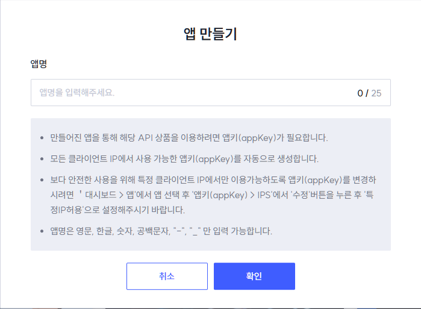</p>

**4.** 아래 항목을 입력하고 이용약관에 전부 동의합니다.

   | 항목 | 값 |
   |---|---|
   | 앱명 | 자유 입력 (예: 내차TmapNda) |
   | 이용 API | `Tmap` 선택 |
   | 사용요금제 | `무료` 선택 |

**5.** 앱이 비활성화 상태라면 만든 앱 → 설정 → 앱 상태 → **활성화** (아래처럼 앱 코드·앱 이름이 보이는 화면입니다)

<p align="center">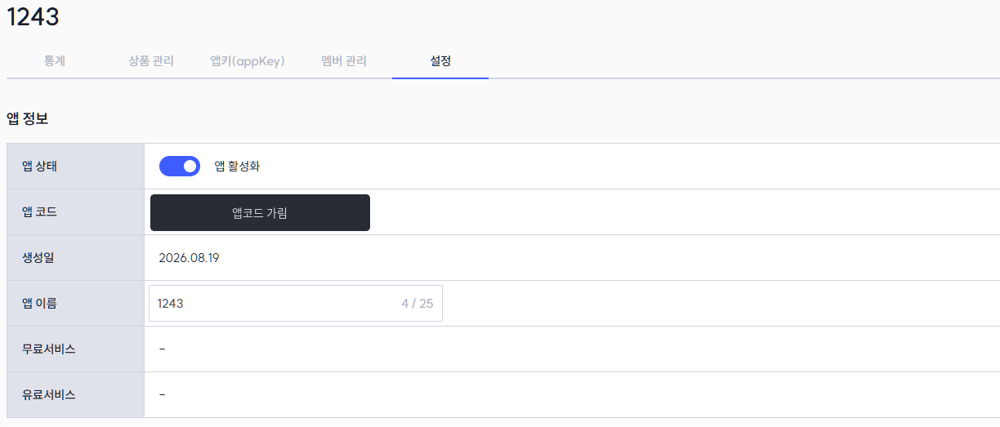</p>

**6.** 상단 **PRODUCTS** 메뉴 클릭 → **TMAP** 선택

<p align="center">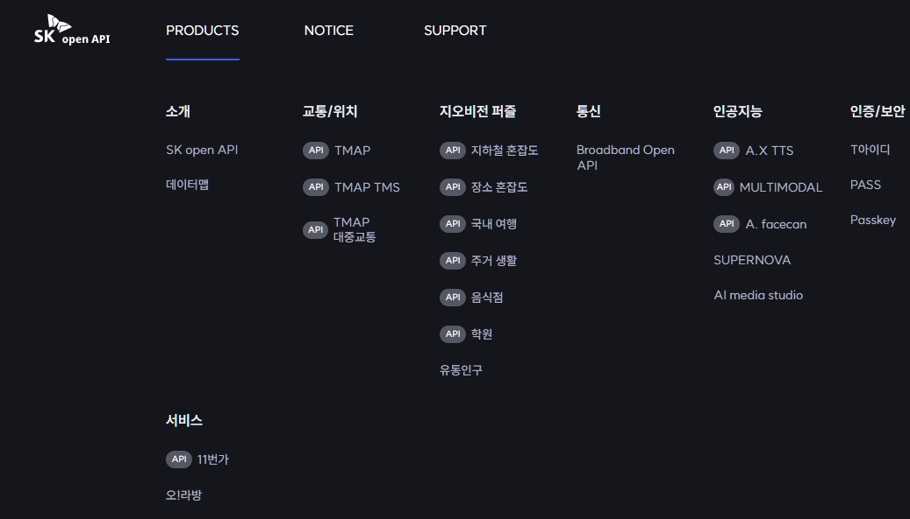</p>

   → **API 사용요금** 이동 → **Free(무료체험)** 카드의 **사용하기** 클릭 → 신청하기 → 앱 신청 (Tmap 무료 API는 보통 즉시~몇 분 내 승인됩니다)

<p align="center">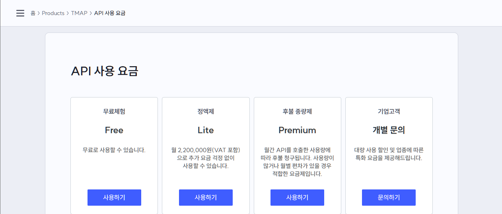</p>

**7.** 앱 목록에서 방금 만든 앱 클릭 → **앱키(appKey)** 탭 이동 → 회색 칸에 발급된 키가 표시되면 옆 복사 아이콘으로 전체 복사 (아래 예시 화면은 보안을 위해 키 부분을 가리고 촬영한 화면입니다)

<p align="center">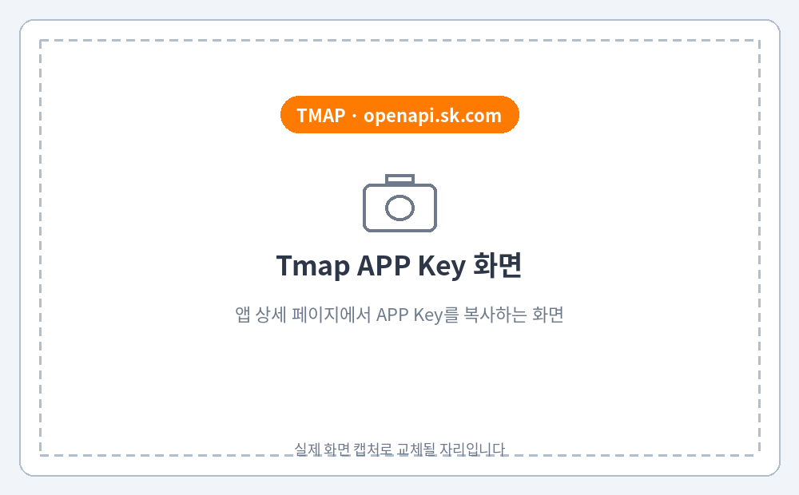</p>

**8.** TmapNda 앱 최초 실행 시 뜨는 초기 화면(안전운행 시작하기 화면)의 앱키 입력란에 붙여넣기 → 저장
   > 이미 한 번 실행했다면 상단바 **≡ 메뉴 → 설정을 길게 누르면** 이 화면으로 다시 이동합니다.

**9.** [developers.kakao.com](https://developers.kakao.com) 접속 → 우측 상단 **로그인** → 카카오 계정으로 로그인 → 상단 메뉴 **앱** 이동 → 우측 상단 빨간 화살표가 가리키는 **+ 앱 생성** 클릭 → 뜨는 팝업에서 아래 항목 입력 후 **저장** (별도 심사 없이 즉시 생성됩니다)

   | 항목 | 값 |
   |---|---|
   | 앱 아이콘 | 선택 사항 (생략 가능) |
   | 앱 이름 * | 자유 입력 (예: TmapNda) |
   | 회사명(사업자명) * | 개인이면 이름 등 아무 문자열 |
   | 카테고리 | 지도/내비게이션 (또는 자유 선택) |

<p align="center">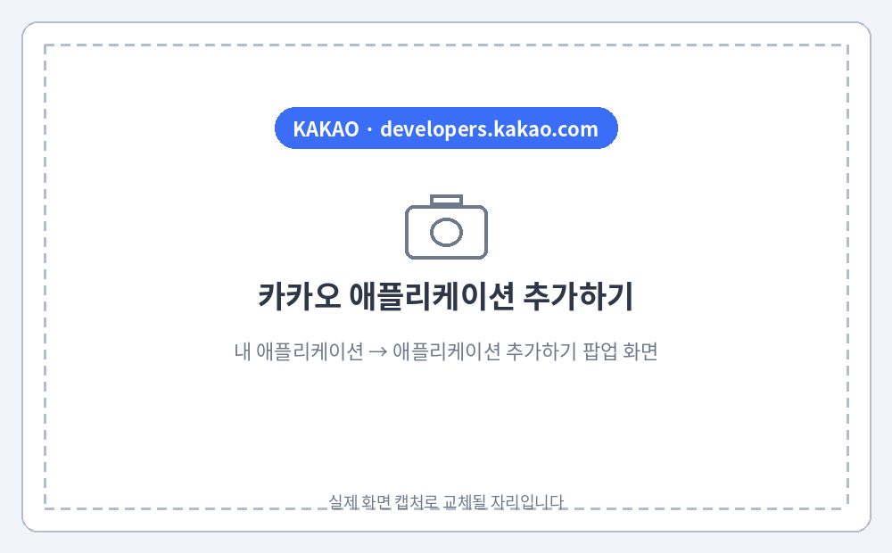</p>

**10.** 생성된 앱 카드 클릭 → 아래 두 가지를 **모두** 진행합니다. 하나라도 빠지면 검색·길안내가 동작하지 않습니다.

   **① 플랫폼(앱 키) 등록** — 좌측 메뉴 **앱 → 플랫폼 키** 클릭 → 빨간 화살표가 가리키는 **네이티브 앱 키(Default Native AppKey)** 클릭 → 화면을 아래로 내려서 **Android 앱 정보**의 패키지명·키 해시 칸에 아래 값을 그대로 복사해서 입력하고 저장

   ```
   패키지명: com.tmap.nda
   키 해시: zQSvbNffsYGnbQksdHmIUbe10V0=
   ```

<p align="center">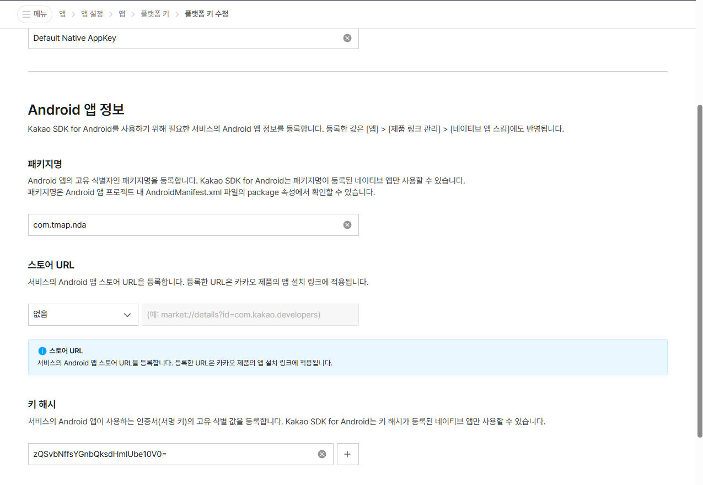</p>

   **② 카카오맵 쿼터 사용 체크** — 좌측 메뉴 **제품 설정 → 카카오맵** 클릭 → **사용 설정** 상태를 **ON**으로 켜고 저장

<p align="center">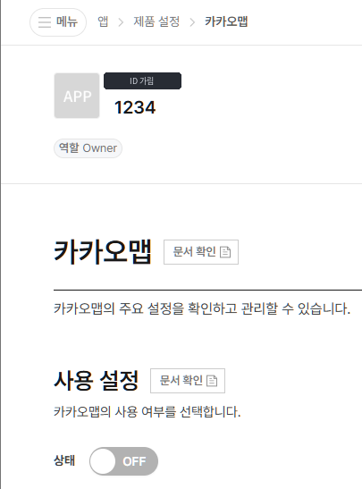</p>

**12.** 아래 두 개의 키를 복사합니다.

   | 키 종류 | 용도 |
   |---|---|
   | REST API 키 | 목적지 검색(장소 검색) 호출에 필요 |
   | Default Native AppKey | 카카오내비 SDK(길안내) 초기화에 필요 |

**13.** TmapNda 앱 초기 화면의 키 입력란에 두 키를 붙여넣기 → 저장 (이미 실행했다면 상단바 **≡ 메뉴 → 설정을 길게 누르면** 재입력 화면으로 이동)

**14.** TmapNda 앱 완전 종료 후 재실행 → 상단바에 `Comma 연결됨` 표시 확인

> **안 될 때 체크 순서:** ① 앱키 복사 시 누락 글자 없는지 → ② 폰과 콤마가 같은 네트워크인지 → ③ TmapNda 재실행했는지
> (더 자세한 진단은 [연결이 안 될 때 체크리스트](#연결이-안-될-때-체크리스트) 참고)

---

## 오피넷 API 키 발급받기 (주유소 브랜드/유가정보용, 선택)

주변 카테고리 검색에서 주유소를 브랜드별·최저가순으로 보려면 오피넷(한국석유공사) API 키가 필요합니다. **각자 발급받아 각자 넣어야 합니다** — 한 사람 키를 여럿이 같이 쓰면 하루 호출 한도(1,500건)가 금방 소진됩니다. 안 넣어도 앱은 정상 작동하고, 이 경우 주유소는 일반 카카오 검색으로 대체됩니다.

**1.** [opinet.co.kr](https://www.opinet.co.kr) 접속 → 우측 상단 **회원가입** → 이용약관 동의 후 휴대폰 인증으로 일반회원 가입

<p align="center">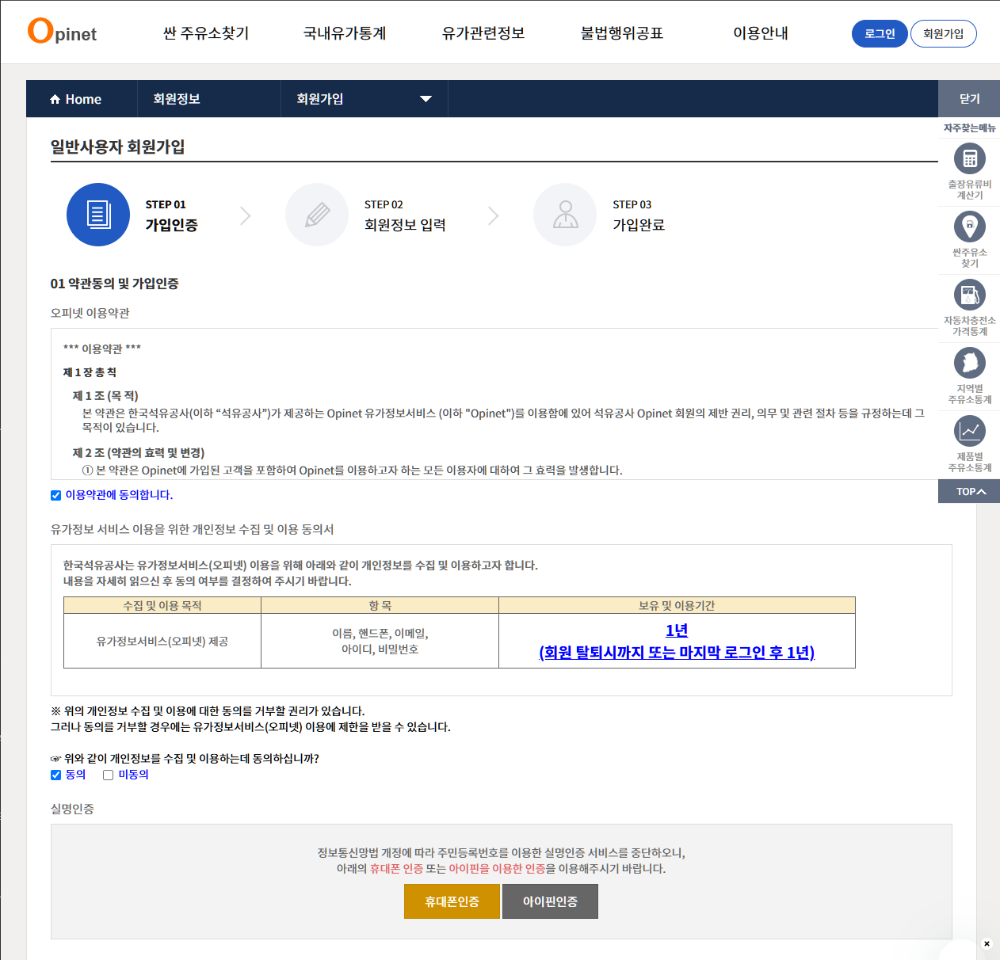</p>

가입이 끝나면 아래처럼 완료 화면이 뜹니다.

<p align="center">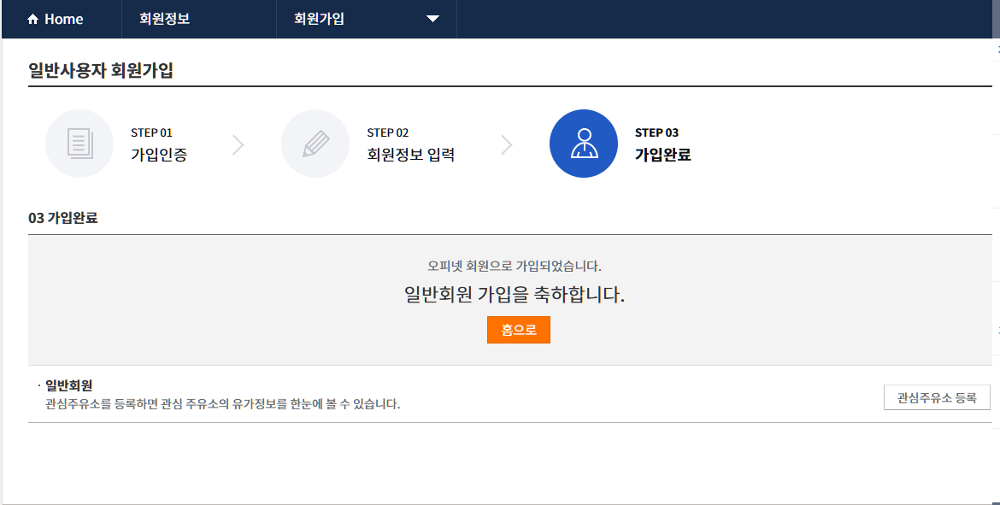</p>

**2.** 로그인 후 상단 메뉴 **유가관련정보 → 유가정보 API** 이동 → **무료 API 이용 신청** 클릭 → 승인되면 마이페이지에서 API 키(인증키) 확인

<p align="center">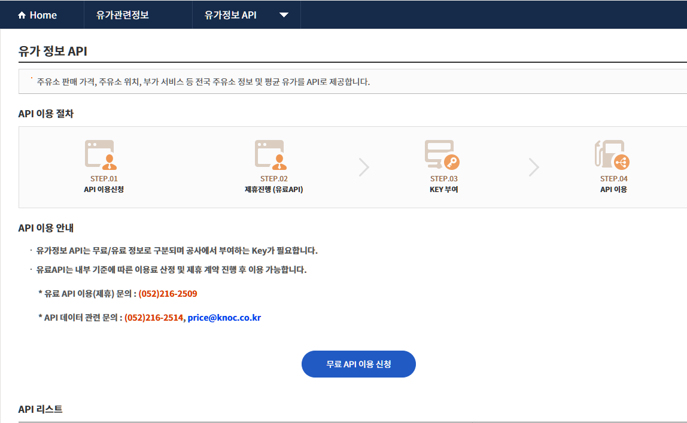</p>

**3.** TmapNda 앱 초기 화면의 **오피넷 API 키** 입력란에 붙여넣기 → 저장 (이미 실행했다면 상단바 **≡ 메뉴 → 설정을 길게 누르면** 재입력 화면으로 이동)

---

## 전기차 충전소 API 키 발급받기 (선택)

주변 카테고리 검색에서 "전기차 충전"을 쓰려면 한국환경공단 API 키가 필요합니다. 이것도 각자 발급받아 각자 넣습니다.

**1.** [data.go.kr](https://www.data.go.kr) 접속 → 우측 상단 **회원가입** → **일반회원(만 14세 이상 내국인)** 선택 → 약관동의 → 정보입력 → 본인인증까지 진행

<p align="center">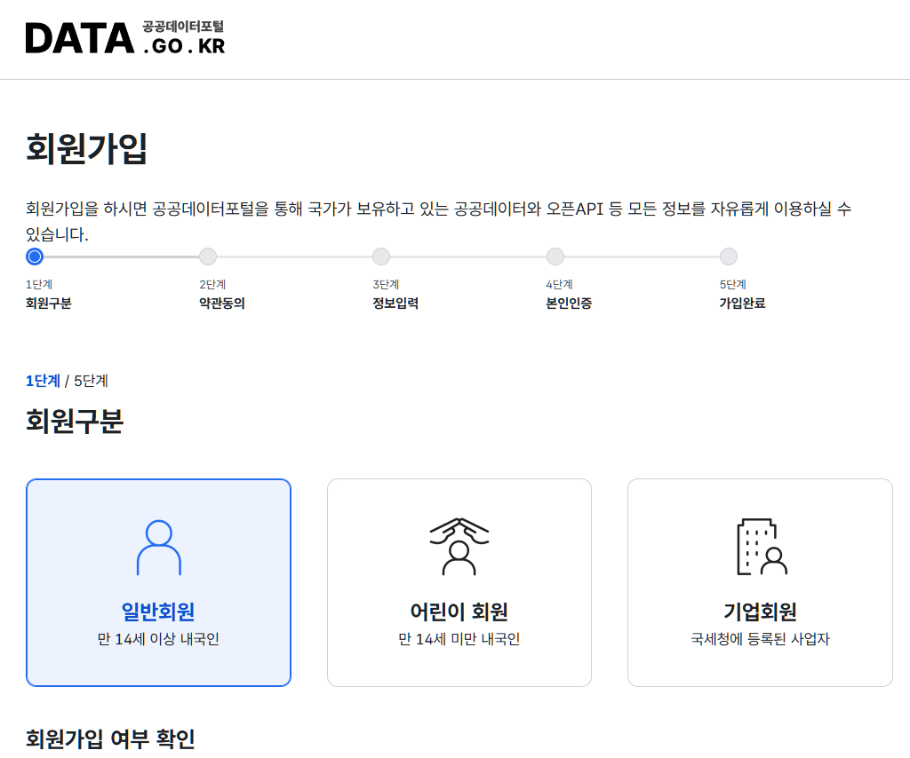</p>

가입이 끝나면 아래처럼 완료 화면이 뜹니다.

<p align="center">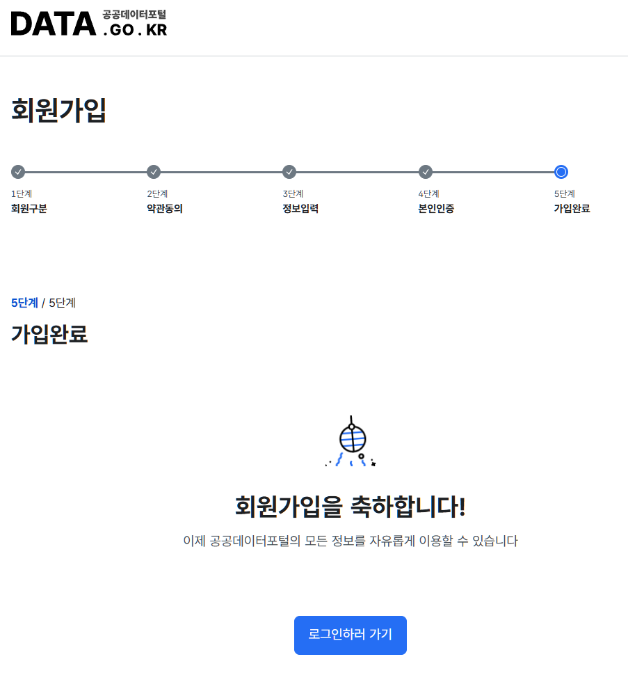</p>

**2.** 로그인 후 홈 화면 검색창에 **"한국환경공단 전기자동차 충전소 정보"** 입력해서 검색

<p align="center">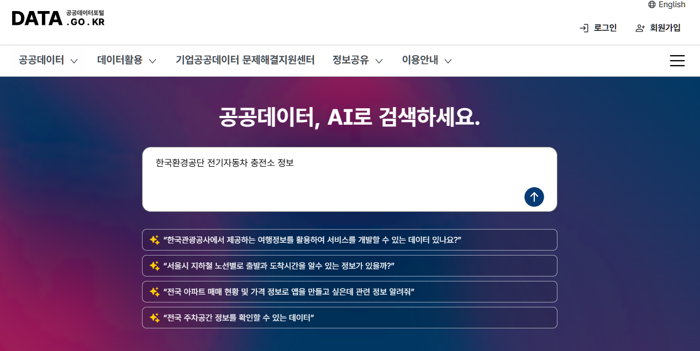</p>

검색 결과에서 관련 데이터 목록이 뜨면, 그중 **오픈API "한국환경공단_전기자동차 충전소 정보"**를 찾습니다.

<p align="center">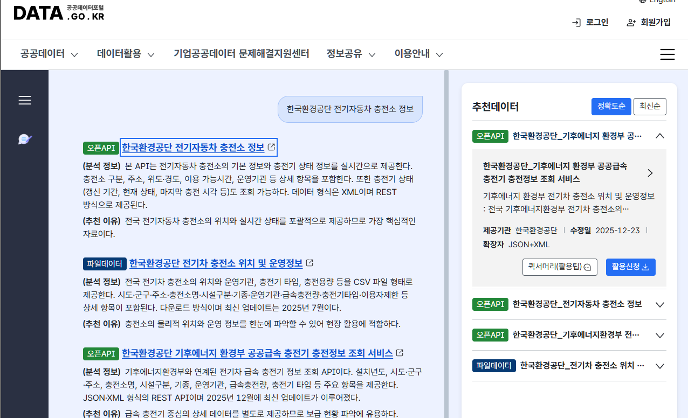</p>

**3.** 해당 데이터 상세 페이지로 들어가면 아래처럼 API 설명이 나옵니다. **활용신청** 버튼을 누르면 신청 폼으로 이동합니다.

<p align="center">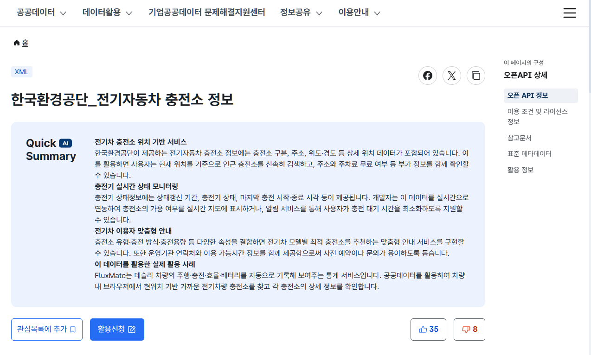</p>

이어지는 신청 폼에서 활용 목적 등을 간단히 작성하고, 화면 하단 라이선스 표시(저작자표시) **동의합니다** 체크 후 **활용신청** 버튼을 눌러 제출합니다 (이 API는 자동승인이라 바로 승인됩니다).

<p align="center">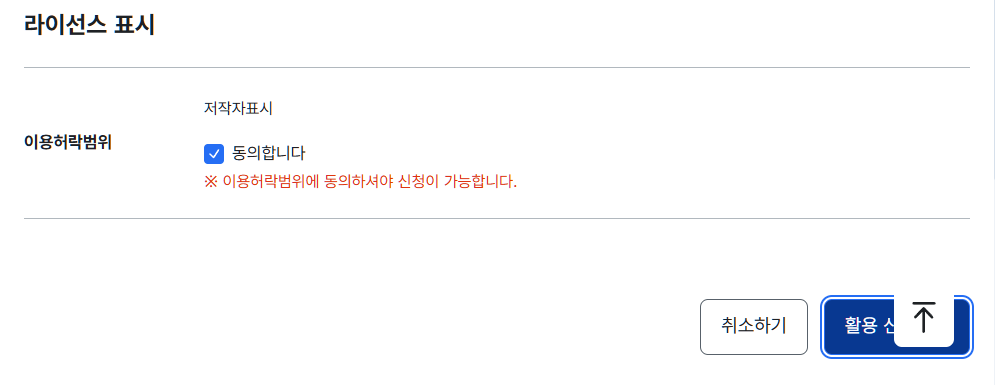</p>

**4.** 마이페이지 → 활용신청 현황에서 승인된 걸 확인 → 상세 항목 클릭 → **일반 인증키(Encoding)** 복사

<p align="center">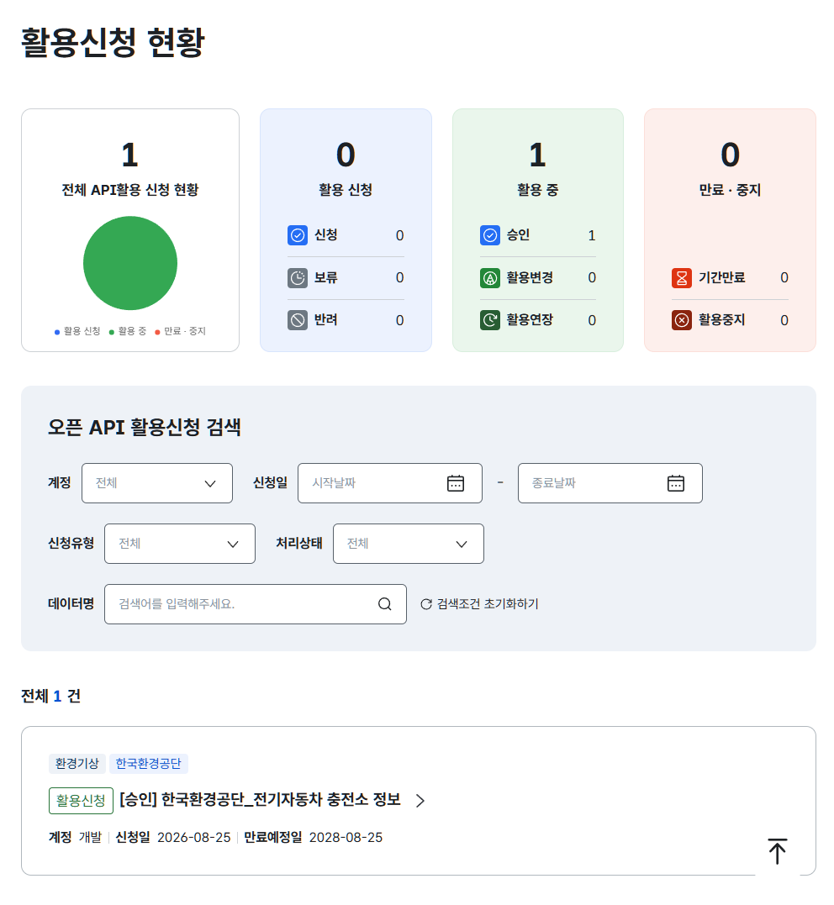</p>

**5.** TmapNda 앱 초기 화면의 **전기차 충전소 API 키** 입력란에 붙여넣기 → 저장 (이미 실행했다면 상단바 **≡ 메뉴 → 설정을 길게 누르면** 재입력 화면으로 이동)

---

## 화면 구성


- **상단바** (Tmap/카카오 화면 공통): 속도 · 도로제한속도 · Comma 연결상태(Comma 연결됨/대기중) · 크루즈 상태(작동중/대기중/불안정) · GPS 정확도 · 음소거 · 목적지 검색(+최근검색) · 집·회사(바로가기) · 로그 전송 · ≡ 메뉴 · (카카오 길안내 중엔 안내종료 버튼) · 이벤트 아이콘(과속카메라·구간단속·방지턱·어린이보호구역·톨게이트 등 24종, 해당될 때만 표시)
  - 화면이 좁으면 상단바가 좌우로 스크롤됩니다.
- **≡ 메뉴(더보기)**: UI 편집 · 업데이트 확인 · 업데이트 내역 · 로그 전체 삭제 · 내 차 위치 · 설정 · 도움말 · 앱 종료
  - 메뉴 버튼을 누르면 바로 아래에 팝업으로 뜨고, 팝업 바깥을 탭하면 자동으로 닫힙니다.
- **UI 편집**: 상단바와 경유지/카테고리/경유지취소 버튼을 각각 원하는 위치로 자유롭게 드래그해서 옮길 수 있습니다. 편집모드에서 옮기고 싶은 요소를 눌러서 이동하고, 우측 상단 체크(✓) 버튼을 누르면 위치가 저장되며 편집이 끝납니다.
- **설정** (v19.1.5부터 안전운전 알림 / 화면 표시 / 버튼 표시 3개 그룹으로 묶어 아코디언으로 정리 - 그룹명을 누르면 펼쳐집니다. 즐겨찾기 표시 개수와 길안내 음량 안내는 그룹 밖에 항상 보입니다.)
  - **안전운전 알림**: 속도 10% 초과 시 경고음 · 이동식카메라 감속 · 목적지 근처 도착 알림(소리+진동) · 상단바에 이벤트(카메라/구간단속/방지턱 등) 표시
  - **화면 표시**: 티맵 위성지도 보기 · 경로선 콤마 화면에 표시(기본 꺼짐) · 티맵 교통 정보(도로 정체 색깔 표시) · 1000m 이상일 때 km 단위로 거리 표시 · 티맵 터치 잠금 해제(핀치줌/드래그 허용, Tmap 화면 한정) · 차선 안내 오버레이 표시(Tmap 화면 한정)
  - **버튼 표시**: 경유지 버튼 표시 · 카테고리 버튼 표시 · 경유지 취소 버튼 표시(경유지가 있을 때만 실제로 나타남)
  - 즐겨찾기 표시 개수 (-/+ 버튼으로 0~5개)
  - 길안내 음량 (설정 슬라이더 대신 차량/헤드유닛 물리 볼륨버튼으로 조절, v18.1부터)

---

## 주변 카테고리 검색

카카오 화면은 (버튼 순서: 카테고리 → 경유지 → 경유지취소), Tmap 화면은 카테고리 버튼만 같은 자리에 있습니다. 카테고리 버튼을 누르면 왼쪽엔 편의점·주유소·전기차 충전·주차장 등 카테고리 목록이, 오른쪽엔 선택한 카테고리의 근처 결과가 뜨며 10개씩 페이지(이전/다음)로 넘겨볼 수 있습니다. 결과에는 이름 · 거리 · 대략적인 예상 소요시간 순으로 표시되고, 주행 중이면 그 지점이 지금 가는 방향과 같은 방향인지("진행방향") 반대 방향인지("역방향")도 GPS 기반으로 표시됩니다(추가 API 호출 없음, 직선거리 기준 추정치).

- **주유소**: 오피넷 API 키가 있으면 처음 한 번 유종(휘발유/경유/LPG)을 고르고, 그 뒤로는 계속 그 유종 기준으로 조회됩니다. 브랜드는 체크박스로 여러 개를 동시에 선택해 저장할 수 있고(예: GS칼텍스+S-OIL), 한 번 저장하면 다음부턴 팝업 없이 바로 그 조건으로 검색됩니다 — 결과 화면 위 "브랜드 필터 변경"으로 언제든 다시 바꿀 수 있습니다. 순수 거리순이 아니라 **가격(70%)과 거리(30%)를 종합**해서 싸고 가까운 곳이 위로 오도록 정렬됩니다. 오피넷 키가 없으면 일반 카카오 검색으로 대체됩니다.
- **전기차 충전소**: 위치는 카카오 검색으로 정확하게 가져오고, 한국환경공단 API 키가 있으면 150m 이내 충전기 상태(대기/충전중/통신이상/운영중지)를 개수까지 세분화해서 붙여줍니다(예: "충전기 4대 (급속 2·완속 2) · 대기 2 · 충전중 1"). 속도 필터(전체/초급속/급속/완속)로 원하는 속도의 충전기가 있는 곳만 걸러볼 수 있습니다. 환경공단 데이터가 매칭 안 되면 "충전기 정보 없음"으로 표시됩니다.
- 나머지 카테고리는 카카오 장소 검색 기반으로 표시됩니다.
- **안내 중일 때**: 카테고리 검색 결과를 고르면 "경유지로 추가할지 / 새 목적지로 바꿀지 / 취소" 확인창이 뜹니다. 경유지로 추가하면 카카오 화면에 빨간 "경유지 취소" 버튼이 나타나고, 누르면 확인 후 경유지 없이 원래 목적지로 다시 안내합니다.
- 카테고리/경유지/경유지취소 버튼은 각각 설정 → 버튼 표시 그룹에서 따로 켜고 끌 수 있습니다.

---

## 즐겨찾기 홈화면 바로가기

즐겨찾기를 길게 눌러 나오는 메뉴에서 "홈화면에 추가"를 선택하면, 안드로이드 홈화면에 그 즐겨찾기 전용 아이콘이 생깁니다(집=파란색, 회사=주황색, 즐겨찾기1~5=빨간 하트로 색깔이 구분됩니다). 아이콘을 누르면 앱이 열리며 안내가 시작되고(다른 목적지로 안내 중이면 먼저 확인을 묻습니다), 이때 그 즐겨찾기에 저장해둔 이동방식(추천/고속도로 우선/무료도로 우선)이 있으면 바로 그 방식으로 안내가 시작되고, 저장해둔 게 없으면 이동방식 선택창이 뜹니다. 즐겨찾기 이름이나 위치를 나중에 수정해도 홈화면 아이콘 내용이 자동으로 같이 바뀝니다.

---

## 내 차 위치

콤마(오픈파일럿) 연결이 끊기면(시동을 끈 것으로 추정) 그 직전 마지막 위치가 자동으로 저장됩니다. 터널 등으로 잠깐 끊겼다가 5분 안에 다시 연결되면 오탐으로 보고 자동 폐기됩니다. ≡ 메뉴의 "내 차 위치"에서 저장된 시각을 확인하고, 기본 지도 앱으로 도보 안내를 시작하거나 지도에서 위치를 볼 수 있습니다.

---

## 목적지 검색

- 검색창에 입력하면 카카오 장소 검색 결과가 최대 50건까지(15건씩 최대 4번 추가 조회) 나오고, 10개씩 페이지로 나눠서 "이전 / 다음 / 취소" 버튼으로 넘겨볼 수 있습니다. 결과가 없는 첫/마지막 페이지에서는 해당 버튼이 흐리게 비활성화됩니다.
- 정렬 순서: **① 검색어와 완전히 같은 이름 → ② 검색어로 시작하는 이름(짧은 쪽 우선) → ③ 검색어 글자가 순서대로 들어있는 이름 → ④ 그 외**, 마지막엔 현재 위치 기준 가까운 순으로 정리됩니다.
- 스타벅스·맥도날드처럼 **DT(드라이브스루) 매장은 이름 길이와 상관없이 항상 위쪽으로**, 그 안에서는 가까운 순으로 뜹니다.
- "편의점", "주유소", "약국", "병원", "카페", "은행", "마트", "주차장" 등 종류로 검색하면 카카오 종류 전용 검색으로 자동 전환되어 더 정확하게 가까운 순으로 나옵니다.
- 검색 결과마다 현재 위치 기준 거리와 예상 소요시간이 함께 표시됩니다(1km 미만은 미터, 이상은 소수점 한 자리 킬로미터).
- 검색창을 직접 눌러 타이핑할 땐 키보드만 뜨고, "최근검색" 아이콘을 눌렀을 때만 검색 이력 팝업이 뜹니다.
- 목적지를 고르면 "추천 경로 / 고속도로 우선 / 무료도로 우선(톨게이트 피하기)" 중 하나를 고르는 팝업이 뜨며, 각 경로의 예상 소요시간이 함께 표시됩니다.

---

## 집·회사·즐겨찾기 빠른 목적지

상단바에 집·회사 아이콘이, 검색 이력 팝업 안에 즐겨찾기(하트, 기본 5칸)가 있습니다. 설정의 "즐겨찾기 표시 개수"에서 0~5개까지 조절할 수 있습니다.

| 상태 | 짧게 누르기 | 길게 누르기 |
|---|---|---|
| 등록 안 됨 | 검색해서 고르면 그 자리에 등록 | 위와 동일 |
| 등록됨 | 이동 방식이 저장돼 있으면 그 방식으로 바로 안내 시작, 아니면 매번 "추천/고속도로/무료도로" 확인(자동 저장 안 됨) | "다시 검색 / 이름 변경 / 이동방식 저장 / 삭제 / 취소" 선택창 |

- 즐겨찾기가 등록되면 하트 대신 장소 이름이 표시되고, 그 아래 현재 위치 기준 예상 소요시간("OO분")이 함께 표시됩니다. 이 시간은 검색 이력 팝업을 열 때마다 실제 카카오 경로 계산으로 새로 구합니다.
- "이름 변경"은 저장된 주소는 그대로 두고 화면에 표시되는 이름만 바꿉니다.
- "삭제"를 선택하면 등록이 해제되어 다시 빈 칸(하트/미등록)으로 돌아갑니다.

---

## 안내 이어가기

길안내 중 앱을 업데이트하거나 강제 종료 후 다시 켜도, 앱을 다시 열면 "OO(으)로 가던 중이었어요. 이어서 안내할까요?"라고 물어봅니다.

- "이어서 안내"를 누르면 바로 그 목적지로 안내가 재개되고, "아니요"를 누르면 무시하고 평소처럼 새로 검색해서 쓸 수 있습니다.
- 목적지에 정상 도착하거나 "안내종료" 버튼으로 직접 끈 경우에는 저장 정보가 자동으로 지워집니다.
- 앱이 업데이트나 강제종료로 이 "끄는 절차"를 거치지 못하고 갑자기 죽었을 때만 저장 정보가 남아 다음 실행 시 물어봅니다.

---

## 카메라·구간단속 정보 우선순위

TmapNda는 Tmap과 카카오 양쪽에서 안전정보(과속카메라·구간단속·방지턱·스쿨존 등)를 동시에 받아, 아래 우선순위로 openpilot에 전달합니다.

1. **카카오 길안내 중이고 그 값이 검증(trusted)됐으면 카카오 값을 우선 채택**
2. **카카오 값이 없거나 검증 안 됐을 때는 Tmap이 감지한 정보를 대신 사용**

카카오 쪽 정보는 경로 기반으로 남은 거리가 정확히 검증된 경우에만 실제로 openpilot에 전달됩니다(직선거리 대신 실제 안내 경로를 따라간 거리로 계산해 곡선 도로에서도 정확도를 높였습니다). 검증에 실패한 경우는 감속에 쓰지 않고 로그로만 남습니다.

---

## 자주 묻는 질문 (FAQ)

**Q. 순정 내비게이션이나 다른 내비 앱과 같이 써도 되나요?**
A. 네, TmapNda는 순정 Tmap이나 차량 내비게이션과 충돌하지 않고 독립적으로 동작합니다.

**Q. `Comma 연결됨`은 뜨는데 크루즈가 계속 대기중이에요. 고장인가요?**
A. 아닙니다. `Comma 연결됨`은 네트워크 연결 여부, `크루즈 작동중/대기중`은 openpilot 제어가 실제로 켜져 있는지를 나타내는 별개의 정보입니다. 아직 크루즈를 켜지 않았다면 대기중으로 뜨는 게 정상입니다.

**Q. Tmap/카카오 키를 잘못 입력했어요. 다시 입력하려면?**
A. 상단바 **≡ 메뉴 → 설정을 길게 누르면** 최초 실행 시 나왔던 키 입력 화면으로 다시 이동합니다.

**Q. 차선 안내 오버레이가 카카오 길안내 화면에서는 안 보여요.**
A. 정상입니다. 차선 안내 오버레이는 Tmap 화면에서만 표시됩니다.

**Q. 즐겨찾기에 등록했는데 누를 때마다 경로를 다시 물어봐요.**
A. 이동 방식이 아직 저장되지 않은 상태입니다. 즐겨찾기를 길게 눌러 "이동방식 저장"을 선택하면, 다음부터는 짧게 누를 때 팝업 없이 바로 안내가 시작됩니다.

---

## 연결이 안 될 때 체크리스트

| 확인 항목 | 방법 |
|---|---|
| Tmap 앱키 입력 여부 | ≡ 메뉴 → **설정을 길게 누르면** 키 재입력 화면으로 이동, 키가 채워져 있는지 확인 |
| 카카오 키 입력 여부 | 목적지 검색·길안내가 안 되면 REST API 키/네이티브 앱 키가 채워져 있는지 확인 |
| 같은 네트워크 여부 | TmapNda 실행 폰과 콤마가 같은 네트워크(같은 SSID)에 붙어있는지, 폰이 다른 Wi-Fi로 자동 전환되지 않았는지 확인 |
| Comma 화면 표시 | 상단바에 `Comma 연결됨` 표시가 뜨는지 확인 |
| 앱 재실행 | 키 입력 후 TmapNda를 껐다 다시 켰는지 확인 |
| 위 방법대로 해도 안 될 시 | 상단바 로그 전송 버튼으로 로그 보내기 (증상을 간단히 적어주세요) |

---

## 문제 발생 시 (버그·오류 신고)

1. TmapNda 상단바 **로그 전송** ↑ 버튼 클릭
2. **이메일** 선택 → 등록된 주소(jae로 시작하는 메일 / choksa55로 시작하는 메일) 두 곳 모두 자동 입력됨 (메일 앱이 열리면 직접 **보내기**를 눌러야 실제로 전송됩니다)
3. **로그 파일만 첨부**해서 전송 (증상을 간단히 본문에 적어주시면 확인이 훨씬 빠릅니다)

필요하면 **≡ 메뉴 → 로그 전체 삭제**로 쌓인 로그를 한 번에 정리할 수 있습니다 (로그는 실행 중 계속 쌓이다가 10MB가 넘으면 자동으로 회전됩니다).

---

## 업데이트 내역

최신 버전은 [Releases 페이지](https://github.com/Rusiperso/TmapNda/releases)에서 APK로 받을 수 있고, 전체 변경 이력은 [RELEASE_NOTES.md](RELEASE_NOTES.md)에서 확인할 수 있습니다.

**최근 업데이트 요약**

- **v19.2.7** — Navdy 연결을 체크박스 설정으로 변경, 백그라운드 자동 재연결 추가

---

## 커뮤니티

사용법 질문, 버그 공유, 업데이트 소식은 카카오톡 오픈채팅방에서 확인할 수 있습니다.

- 오픈채팅: https://open.kakao.com/o/gORB6tFi
- 입장 비밀번호: `134679`
